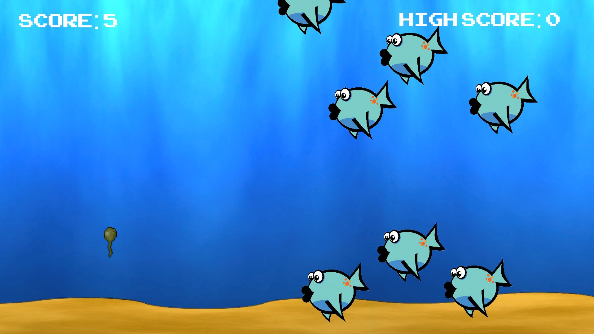

# Tadpole-Mania-Unity-Game

Tadpole Mania is a mini-game written in C# and made in Unity. As the player, you will control a tadpole by using the WASD keys, and avoid being eaten by fish! As you survive, your score increases. When a fish eats you, your score resets.

## Features
- Avoid the fish for as long as possible.
- Each second you stay alive, your score increases.
- Control a tadpole with the WASD keys.
- Beat your previous high score.
- Makes use of a SpriteRenderer, Rigidbody2D, BoxCollider2D, TextMeshPro, TextMeshPro, Audio Source.

## Credits
- Tadpole: https://opengameart.org/content/tadpole-pixelated-creature-w-simple-animation - @CroomFolk
- Background: https://opengameart.org/content/underwater-scene-loopable - @Scribe
- Fish: https://opengameart.org/content/aqua-fish - @Psyk23
- Fonts: https://www.1001fonts.com/video-game-fonts.html
- Sound Effects: https://pixabay.com/sound-effects/search/underwater/
- Background Music: https://pixabay.com/music/search/genre/video%20games/

